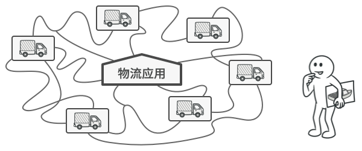
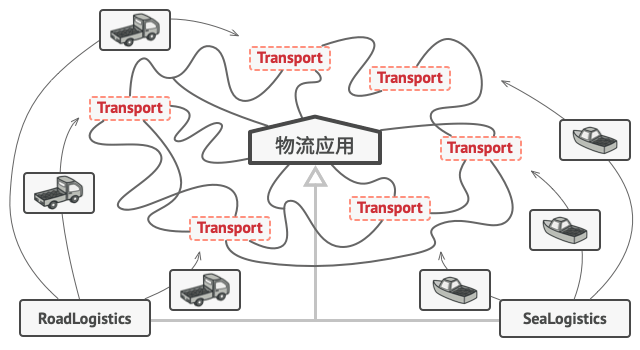
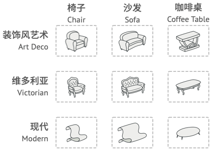
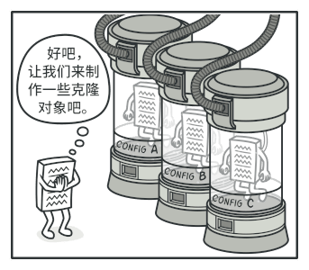
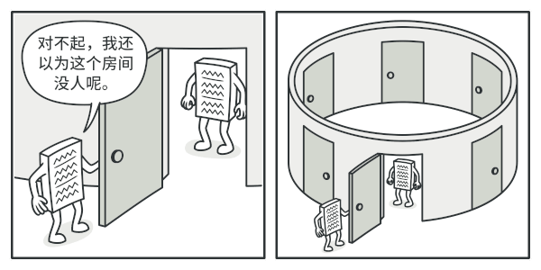
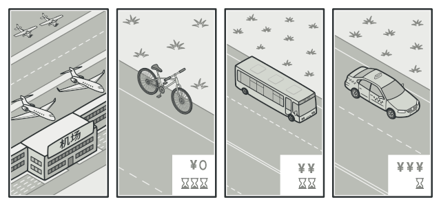

# 设计模式

## 引用
[设计模式](https://refactoringguru.cn/design-patterns)
## 工厂方法模式

亦称： `虚拟构造函数`、`Virtual Constructor`、`Factory Method`

### 意图

**工厂方法模式**是一种创建型设计模式， 其在父类中提供一个创建对象的方法， 允许子类决定实例化对象的类型。


### 问题

假设你正在开发一款物流管理应用。 最初版本只能处理卡车运输， 因此大部分代码都在位于名为 `卡车`的类中。

一段时间后， 这款应用变得极受欢迎。 你每天都能收到十几次来自海运公司的请求， 希望应用能够支持海上物流功能。



如果代码其余部分与现有类已经存在耦合关系， 那么向程序中添加新类其实并没有那么容易。

这可是个好消息。 但是代码问题该如何处理呢？ 目前， 大部分代码都与 `卡车`类相关。 在程序中添加 `轮船`类需要修改全部代码。 更糟糕的是， 如果你以后需要在程序中支持另外一种运输方式， 很可能需要再次对这些代码进行大幅修改。

最后， 你将不得不编写繁复的代码， 根据不同的运输对象类， 在应用中进行不同的处理。

### 解决方案

工厂方法模式建议使用特殊的*工厂*方法代替对于对象构造函数的直接调用 （即使用 `new`运算符）。 不用担心， 对象仍将通过 `new`运算符创建， 只是该运算符改在工厂方法中调用罢了。 工厂方法返回的对象通常被称作 “产品”。


子类可以修改工厂方法返回的对象类型。

乍看之下， 这种更改可能毫无意义： 我们只是改变了程序中调用构造函数的位置而已。 但是， 仔细想一下， 现在你可以在子类中重写工厂方法， 从而改变其创建产品的类型。

但有一点需要注意:仅当这些产品具有共同的基类或者接口时， 子类才能返回不同类型的产品， 同时基类中的工厂方法还应将其返回类型声明为这一共有接口。


所有产品都必须使用同一接口。

举例来说，  `卡车`Truck和 `轮船`Ship类都必须实现 `运输`Transport接口， 该接口声明了一个名为 `deliver`交付的方法。 每个类都将以不同的方式实现该方法： 卡车走陆路交付货物， 轮船走海路交付货物。  `陆路运输`Road­Logistics类中的工厂方法返回卡车对象， 而 `海路运输`Sea­Logistics类则返回轮船对象。



只要产品类实现一个共同的接口， 你就可以将其对象传递给客户代码， 而无需提供额外数据。

调用工厂方法的代码 （通常被称为*客户端*代码） 无需了解不同子类返回实际对象之间的差别。 客户端将所有产品视为抽象的 `运输` 。 客户端知道所有运输对象都提供 `交付`方法， 但是并不关心其具体实现方式。

### 工厂方法模式结构


1. **产品** （Product） 将会对接口进行声明。 对于所有由创建者及其子类构建的对象， 这些接口都是通用的。
2. **具体产品** （Concrete Products） 是产品接口的不同实现。
3. **创建者** （Creator） 类声明返回产品对象的工厂方法。 该方法的返回对象类型必须与产品接口相匹配。你可以将工厂方法声明为抽象方法， 强制要求每个子类以不同方式实现该方法。 或者， 你也可以在基础工厂方法中返回默认产品类型。注意， 尽管它的名字是创建者， 但它最主要的职责并**不是**创建产品。 一般来说， 创建者类包含一些与产品相关的核心业务逻辑。 工厂方法将这些逻辑处理从具体产品类中分离出来。 打个比方， 大型软件开发公司拥有程序员培训部门。 但是， 这些公司的主要工作还是编写代码， 而非生产程序员。
4. **具体创建者** （Concrete Creators） 将会重写基础工厂方法， 使其返回不同类型的产品。注意， 并不一定每次调用工厂方法都会**创建**新的实例。 工厂方法也可以返回缓存、 对象池或其他来源的已有对象。

### 代码

```java
public interface Transport {
    /**
     * 交付方法
     */
    void deliver();
}

```
```java
public class Truck implements Transport {
    @Override
    public void deliver() {
        System.out.println("卡车跨越欧亚大陆运输");
    }
}
```
```java
public class Steamship implements Transport {
    @Override
    public void deliver() {
        System.out.println("轮船跨越太平洋运输");
    }
}
```
```java
public class AirFreighter implements Transport {
    @Override
    public void deliver() {
        System.out.println("飞机跨越北冰洋运输");
    }
}
```
```java
public abstract class Logistics {
    /**
     * 创建
     */
    public abstract Transport createTransport();

    /**
     * 计划交付
     */
    public void planDelivery() {
        Transport transport = createTransport();
        transport.deliver();
    }
}
```
```java
public class RoadLogistics extends Logistics {
    @Override
    public Transport createTransport() {
        return new Truck();
    }
}
```
```java
public class SeaLogistics extends Logistics {
    @Override
    public Transport createTransport() {
        return new Steamship();
    }
}
```
```java
public class SkyLogistics extends Logistics {
    @Override
    public Transport createTransport() {
        return new AirFreighter();
    }
}
```
```java
public enum LogisticsEnum {
    ROAD("陆路运输", 101),
    SEA("海路运输", 102),
    SKY("空路运输", 103);

    private String mode;
    private Integer code;

    LogisticsEnum(String mode, Integer code) {
        this.mode = mode;
        this.code = code;
    }

    public String getMode() {
        return mode;
    }

    public void setMode(String mode) {
        this.mode = mode;
    }

    public Integer getCode() {
        return code;
    }

    public void setCode(Integer code) {
        this.code = code;
    }
}
```
```java
public class FactoryMethodClient {
    private static Logistics logistics;

    public static void main(String[] args) {
        initLogistics(LogisticsEnum.SKY);
        planDelivery();
        initLogistics(LogisticsEnum.ROAD);
        planDelivery();
        initLogistics(LogisticsEnum.SEA);
        planDelivery();
    }

    private static void planDelivery() {
        logistics.planDelivery();
    }

    private static void initLogistics(LogisticsEnum logisticsEnum) {
        if (logisticsEnum.getCode().equals(101)) {
            logistics = new RoadLogistics();
        } else if (logisticsEnum.getCode().equals(102)){
            logistics = new SeaLogistics();
        } else if (logisticsEnum.getCode().equals(103)) {
            logistics = new SkyLogistics();
        }else {
            throw new RuntimeException("初始化失败");
        }
    }
}
```
## 抽象工厂模式

亦称： `Abstract Factory`

### 意图

**抽象工厂模式**是一种创建型设计模式， 它能创建一系列相关的对象， 而无需指定其具体类。


### 问题

假设你正在开发一款家具商店模拟器。 你的代码中包括一些类， 用于表示：

1. 一系列相关产品， 例如 `椅子`Chair 、  `沙发`Sofa和 `咖啡桌`Coffee­Table 。
2. 系列产品的不同变体。 例如， 你可以使用 `现代`Modern 、  `维多利亚`Victorian 、  `装饰风艺术`Art­Deco等风格生成 `椅子` 、  `沙发`和 `咖啡桌` 。



系列产品及其不同变体。

你需要设法单独生成每件家具对象， 这样才能确保其风格一致。 如果顾客收到的家具风格不一样， 他们可不会开心。


现代风格的沙发和维多利亚风格的椅子不搭。

此外， 你也不希望在添加新产品或新风格时修改已有代码。 家具供应商对于产品目录的更新非常频繁， 你不会想在每次更新时都去修改核心代码的。

### 解决方案

首先， 抽象工厂模式建议为系列中的每件产品明确声明接口 （例如椅子、 沙发或咖啡桌）。 然后， 确保所有产品变体都继承这些接口。 例如， 所有风格的椅子都实现 `椅子`接口； 所有风格的咖啡桌都实现 `咖啡桌`接口， 以此类推。


同一对象的所有变体都必须放置在同一个类层次结构之中。

接下来， 我们需要声明*抽象工厂*——包含系列中所有产品构造方法的接口。 例如 `create­Chair`创建椅子 、  `create­Sofa`创建沙发和 `create­Coffee­Table`创建咖啡桌 。 这些方法必须返回**抽象**产品类型， 即我们之前抽取的那些接口：  `椅子` ，  `沙发`和 `咖啡桌`等等。


每个具体工厂类都对应一个特定的产品变体。

那么该如何处理产品变体呢？ 对于系列产品的每个变体， 我们都将基于 `抽象工厂`接口创建不同的工厂类。 每个工厂类都只能返回特定类别的产品， 例如，  `现代家具工厂`Modern­Furniture­Factory只能创建 `现代椅子`Modern­Chair 、  `现代沙发`Modern­Sofa和 `现代咖啡桌`Modern­Coffee­Table对象。

客户端代码可以通过相应的抽象接口调用工厂和产品类。 你无需修改实际客户端代码， 就能更改传递给客户端的工厂类， 也能更改客户端代码接收的产品变体。


客户端无需了解其所调用工厂的具体类信息。

假设客户端想要工厂创建一把椅子。 客户端无需了解工厂类， 也不用管工厂类创建出的椅子类型。 无论是现代风格， 还是维多利亚风格的椅子， 对于客户端来说没有分别， 它只需调用抽象 `椅子`接口就可以了。 这样一来， 客户端只需知道椅子以某种方式实现了 `sit­On`坐下方法就足够了。 此外， 无论工厂返回的是何种椅子变体， 它都会和由同一工厂对象创建的沙发或咖啡桌风格一致。

最后一点说明： 如果客户端仅接触抽象接口， 那么谁来创建实际的工厂对象呢？ 一般情况下， 应用程序会在初始化阶段创建具体工厂对象。 而在此之前， 应用程序必须根据配置文件或环境设定选择工厂类别。

### 抽象工厂模式结构


1. **抽象产品** （Abstract Product） 为构成系列产品的一组不同但相关的产品声明接口。
2. **具体产品** （Concrete Product） 是抽象产品的多种不同类型实现。 所有变体 （维多利亚/现代） 都必须实现相应的抽象产品 （椅子/沙发）。
3. **抽象工厂** （Abstract Factory） 接口声明了一组创建各种抽象产品的方法。
4. **具体工厂** （Concrete Factory） 实现抽象工厂的构建方法。 每个具体工厂都对应特定产品变体， 且仅创建此种产品变体。
5. 尽管具体工厂会对具体产品进行初始化， 其构建方法签名必须返回相应的*抽象*产品。 这样， 使用工厂类的客户端代码就不会与工厂创建的特定产品变体耦合。 **客户端** （Client） 只需通过抽象接口调用工厂和产品对象， 就能与任何具体工厂/产品变体交互。

### 代码

```java
public interface Chair {
    void sitOn(String name);
}
```
```java
public class VictorianChair implements Chair {
    @Override
    public void sitOn(String name) {
        System.out.println(name + "坐在维多利亚风格的椅子上");
    }
}
```
```java
public class ModernChair implements Chair {
    @Override
    public void sitOn(String name) {
        System.out.println(name + "坐在现代风格的椅子上");
    }
}
```
```java
public class ArtDecoChair implements Chair {
    @Override
    public void sitOn(String name) {
        System.out.println(name + "坐在装饰风艺术风格的椅子上");
    }
}
```
```java
public interface Sofa {
    void sitOn(List<String> names);
}
```
```java
public class VictorianSofa implements Sofa {
    @Override
    public void sitOn(List<String> names) {
        System.out.println(names + "坐在维多利亚风格的沙发上");
    }
}
```
```java
public class ModernSofa implements Sofa {
    @Override
    public void sitOn(List<String> names) {
        System.out.println(names + "坐在现代风格的沙发上");
    }
}
```
```java
public class ArtDecoSofa implements Sofa {
    @Override
    public void sitOn(List<String> names) {
        System.out.println(names + "坐在装饰风艺术风格的沙发上");
    }
}
```
```java
public interface CoffeeTable {
    void putOn(List<String> goods);
}
```
```java
public class VictorianCoffeeTable implements CoffeeTable {
    @Override
    public void putOn(List<String> goods) {
        System.out.println("将" + goods + "放在维多利亚风格咖啡桌上");
    }
}
```
```java
public class ModernCoffeeTable implements CoffeeTable {
    @Override
    public void putOn(List<String> goods) {
        System.out.println("将" + goods + "放在现在风格咖啡桌上");
    }
}
```
```java
public class ArtDecoCoffeeTable implements CoffeeTable {
    @Override
    public void putOn(List<String> goods) {
        System.out.println("将" + goods + "放在装饰风艺术风格咖啡桌上");
    }
}
```
```java
public interface FurnitureFactory {
    Chair createChair();

    Sofa createSofa();

    CoffeeTable createCoffeeTable();
}
```
```java
public class VictorianFurnitureFactory implements FurnitureFactory {
    @Override
    public Chair createChair() {
        return new VictorianChair();
    }

    @Override
    public Sofa createSofa() {
        return new VictorianSofa();
    }

    @Override
    public CoffeeTable createCoffeeTable() {
        return new VictorianCoffeeTable();
    }
}
```
```java
public class ModernFurnitureFactory implements FurnitureFactory {
    @Override
    public Chair createChair() {
        return new ModernChair();
    }

    @Override
    public Sofa createSofa() {
        return new ModernSofa();
    }

    @Override
    public CoffeeTable createCoffeeTable() {
        return new ModernCoffeeTable();
    }
}
```
```java
public class ArtDecoFurnitureFactory implements FurnitureFactory {
    @Override
    public Chair createChair() {
        return new ArtDecoChair();
    }

    @Override
    public Sofa createSofa() {
        return new ArtDecoSofa();
    }

    @Override
    public CoffeeTable createCoffeeTable() {
        return new ArtDecoCoffeeTable();
    }
}
```
```java
public enum Style {
    ART_DECO,
    VICTORIAN,
    MODERN
}
```
```java
public class Combination {
    private final FurnitureFactory furnitureFactory;

    public Combination(FurnitureFactory furnitureFactory) {
        this.furnitureFactory = furnitureFactory;
    }

    public void use(String name, List<String> names, List<String> goods) {
        Chair chair = furnitureFactory.createChair();
        chair.sitOn(name);
        Sofa sofa = furnitureFactory.createSofa();
        sofa.sitOn(names);
        CoffeeTable coffeeTable = furnitureFactory.createCoffeeTable();
        coffeeTable.putOn(goods);
    }
}
```
```java
public class AbstractFactoryClient {

    public static void main(String[] args) {
        String name = "张飞";
        List<String> names = Lists.newArrayList("刘备", "关羽");
        List<String> goods = Lists.newArrayList("雌雄双股剑", "青龙偃月刀", "丈八蛇矛");
        initCombination(Style.MODERN).use(name, names, goods);
        initCombination(Style.VICTORIAN).use(name, names, goods);
        initCombination(Style.ART_DECO).use(name, names, goods);
    }

    private static Combination initCombination(Style style) {
        FurnitureFactory furnitureFactory;
        if (Style.ART_DECO.equals(style)) {
            furnitureFactory = new ArtDecoFurnitureFactory();
        } else if (Style.MODERN.equals(style)) {
            furnitureFactory = new ModernFurnitureFactory();
        } else if (Style.VICTORIAN.equals(style)) {
            furnitureFactory = new VictorianFurnitureFactory();
        }else {
            throw new RuntimeException("风格参数错误");
        }
        return new Combination(furnitureFactory);
    }
}

```
## 建造者模式

亦称： `建造者模式`、`Builder`

### 意图

**生成器模式**是一种创建型设计模式， 使你能够分步骤创建复杂对象。 该模式允许你使用相同的创建代码生成不同类型和形式的对象。


### 问题

假设有这样一个复杂对象， 在对其进行构造时需要对诸多成员变量和嵌套对象进行繁复的初始化工作。 这些初始化代码通常深藏于一个包含众多参数且让人基本看不懂的构造函数中； 甚至还有更糟糕的情况， 那就是这些代码散落在客户端代码的多个位置。


如果为每种可能的对象都创建一个子类， 这可能会导致程序变得过于复杂。

例如， 我们来思考如何创建一个 `房屋`House对象。 建造一栋简单的房屋， 首先你需要建造四面墙和地板， 安装房门和一套窗户， 然后再建造一个屋顶。 但是如果你想要一栋更宽敞更明亮的房屋， 还要有院子和其他设施 （例如暖气、 排水和供电设备）， 那又该怎么办呢？

最简单的方法是扩展 `房屋`基类， 然后创建一系列涵盖所有参数组合的子类。 但最终你将面对相当数量的子类。 任何新增的参数 （例如门廊类型） 都会让这个层次结构更加复杂。

另一种方法则无需生成子类。 你可以在 `房屋`基类中创建一个包括所有可能参数的超级构造函数， 并用它来控制房屋对象。 这种方法确实可以避免生成子类， 但它却会造成另外一个问题。


拥有大量输入参数的构造函数也有缺陷： 这些参数也不是每次都要全部用上的。

通常情况下， 绝大部分的参数都没有使用， 这使得[对于构造函数的调用十分不简洁](https://refactoringguru.cn/smells/long-parameter-list)。 例如， 只有很少的房子有游泳池， 因此与游泳池相关的参数十之八九是毫无用处的。

### 解决方案

生成器模式建议将对象构造代码从产品类中抽取出来， 并将其放在一个名为*生成器*的独立对象中。


生成器模式让你能够分步骤创建复杂对象。 生成器不允许其他对象访问正在创建中的产品。

该模式会将对象构造过程划分为一组步骤， 比如 `build­Walls`创建墙壁和 `build­Door`创建房门创建房门等。 每次创建对象时， 你都需要通过生成器对象执行一系列步骤。 重点在于你无需调用所有步骤， 而只需调用创建特定对象配置所需的那些步骤即可。

当你需要创建不同形式的产品时， 其中的一些构造步骤可能需要不同的实现。 例如， 木屋的房门可能需要使用木头制造， 而城堡的房门则必须使用石头制造。

在这种情况下， 你可以创建多个不同的生成器， 用不同方式实现一组相同的创建步骤。 然后你就可以在创建过程中使用这些生成器 （例如按顺序调用多个构造步骤） 来生成不同类型的对象。


不同生成器以不同方式执行相同的任务。

例如， 假设第一个建造者使用木头和玻璃制造房屋， 第二个建造者使用石头和钢铁， 而第三个建造者使用黄金和钻石。 在调用同一组步骤后， 第一个建造者会给你一栋普通房屋， 第二个会给你一座小城堡， 而第三个则会给你一座宫殿。 但是， 只有在调用构造步骤的客户端代码可以通过通用接口与建造者进行交互时， 这样的调用才能返回需要的房屋。

#### 主管

你可以进一步将用于创建产品的一系列生成器步骤调用抽取成为单独的*主管*类。 主管类可定义创建步骤的执行顺序， 而生成器则提供这些步骤的实现。


主管知道需要哪些创建步骤才能获得可正常使用的产品。

严格来说， 你的程序中并不一定需要主管类。 客户端代码可直接以特定顺序调用创建步骤。 不过， 主管类中非常适合放入各种例行构造流程， 以便在程序中反复使用。

此外， 对于客户端代码来说， 主管类完全隐藏了产品构造细节。 客户端只需要将一个生成器与主管类关联， 然后使用主管类来构造产品， 就能从生成器处获得构造结果了。

### 生成器模式结构


1. **生成器** （Builder） 接口声明在所有类型生成器中通用的产品构造步骤。
2. **具体生成器** （Concrete Builders） 提供构造过程的不同实现。 具体生成器也可以构造不遵循通用接口的产品。
3. **产品** （Products） 是最终生成的对象。 由不同生成器构造的产品无需属于同一类层次结构或接口。
4. **主管** （Director） 类定义调用构造步骤的顺序， 这样你就可以创建和复用特定的产品配置。
5. **客户端** （Client） 必须将某个生成器对象与主管类关联。 一般情况下， 你只需通过主管类构造函数的参数进行一次性关联即可。 此后主管类就能使用生成器对象完成后续所有的构造任务。 但在客户端将生成器对象传递给主管类制造方法时还有另一种方式。 在这种情况下， 你在使用主管类生产产品时每次都可以使用不同的生成器。

### 代码

```java
@Data
@AllArgsConstructor
@NoArgsConstructor
@ToString
public class House {
    private String wall;

    private String door;

    private String window;

    private String roof;
}
```
```java
public enum HouseType {
    POOL, GARAGE
}
```
```java
@EqualsAndHashCode(callSuper = true)
@AllArgsConstructor
@NoArgsConstructor
@Data
@ToString(callSuper = true)
public class GarageHouse extends House {
    private String garage;
}
```
```java
@EqualsAndHashCode(callSuper = true)
@AllArgsConstructor
@NoArgsConstructor
@Data
@ToString(callSuper = true)
public class PoolHouse extends House {
    private String swimmingPool;
}
```
```java
public interface HouseBuilder {
    void init();

    void buildWall();

    void buildDoor();

    void buildWindow();

    void buildRoof();

    default void buildGarage() {
    }

    default void buildSwimmingPool() {
    }

    House getHouse();
}
```
```java
public class GarageHouseBuilder implements HouseBuilder {
    private GarageHouse garageHouse;

    @Override
    public void init() {
        this.garageHouse = new GarageHouse();
    }

    @Override
    public void buildWall() {
        this.garageHouse.setWall("砖墙");
    }

    @Override
    public void buildDoor() {
        this.garageHouse.setDoor("防盗门");
    }

    @Override
    public void buildWindow() {
        this.garageHouse.setWindow("玻璃窗");
    }

    @Override
    public void buildRoof() {
        this.garageHouse.setRoof("金属顶");
    }

    @Override
    public void buildGarage() {
        this.garageHouse.setGarage("升降门车库");
    }

    @Override
    public House getHouse() {
        return this.garageHouse;
    }
}
```
```java
public class PoolHouseBuilder implements HouseBuilder {
    private PoolHouse poolHouse;

    @Override
    public void init() {
        this.poolHouse = new PoolHouse();
    }

    @Override
    public void buildWall() {
        this.poolHouse.setWall("木墙");
    }

    @Override
    public void buildDoor() {
        this.poolHouse.setDoor("木门");
    }

    @Override
    public void buildWindow() {
        this.poolHouse.setWindow("纱窗");
    }

    @Override
    public void buildRoof() {
        this.poolHouse.setRoof("木顶");
    }

    @Override
    public void buildSwimmingPool() {
        this.poolHouse.setSwimmingPool("水沟");
    }

    @Override
    public House getHouse() {
        return this.poolHouse;
    }
}
```
```java
public class ConstructionTeam {
    private HouseBuilder houseBuilder;

    public void changeBuilder(HouseBuilder houseBuilder) {
        this.houseBuilder = houseBuilder;
    }

    public House make(HouseType type, boolean totalMoney) {
        if (HouseType.GARAGE.equals(type)) {
            initHouse();
            if (totalMoney) {
                houseBuilder.buildGarage();
            }
        }
        if (HouseType.POOL.equals(type)) {
            initHouse();
            if (totalMoney) {
                houseBuilder.buildSwimmingPool();
            }
        }
        return houseBuilder.getHouse();
    }

    private void initHouse() {
        houseBuilder.init();
        houseBuilder.buildDoor();
        houseBuilder.buildRoof();
        houseBuilder.buildWall();
        houseBuilder.buildWindow();
    }
}
```
```java
public class BuilderClient {
    public static void main(String[] args) {
        ConstructionTeam constructionTeam = new ConstructionTeam();
        constructionTeam.changeBuilder(new GarageHouseBuilder());
        House garage = constructionTeam.make(HouseType.GARAGE, false);
        System.out.println(garage);
        constructionTeam.changeBuilder(new PoolHouseBuilder());
        House pool = constructionTeam.make(HouseType.POOL, true);
        System.out.println(pool);
    }
}
```

## 原型模式

亦称： `克隆`、`Clone`、`Prototype`

### 意图

**原型模式**是一种创建型设计模式， 使你能够复制已有对象， 而又无需使代码依赖它们所属的类。


### 问题

如果你有一个对象， 并希望生成与其完全相同的一个复制品， 你该如何实现呢？ 首先， 你必须新建一个属于相同类的对象。 然后， 你必须遍历原始对象的所有成员变量， 并将成员变量值复制到新对象中。

不错！ 但有个小问题。 并非所有对象都能通过这种方式进行复制， 因为有些对象可能拥有私有成员变量， 它们在对象本身以外是不可见的。


“从外部” 复制对象[并非](https://refactoringguru.cn/cargo-cult)总是可行。

直接复制还有另外一个问题。 因为你必须知道对象所属的类才能创建复制品， 所以代码必须依赖该类。 即使你可以接受额外的依赖性， 那还有另外一个问题： 有时你只知道对象所实现的接口， 而不知道其所属的具体类， 比如可向方法的某个参数传入实现了某个接口的任何对象。

### 解决方案

原型模式将克隆过程委派给被克隆的实际对象。 模式为所有支持克隆的对象声明了一个通用接口， 该接口让你能够克隆对象， 同时又无需将代码和对象所属类耦合。 通常情况下， 这样的接口中仅包含一个 `克隆`方法。

所有的类对 `克隆`方法的实现都非常相似。 该方法会创建一个当前类的对象， 然后将原始对象所有的成员变量值复制到新建的类中。 你甚至可以复制私有成员变量， 因为绝大部分编程语言都允许对象访问其同类对象的私有成员变量。

支持克隆的对象即为*原型*。 当你的对象有几十个成员变量和几百种类型时， 对其进行克隆甚至可以代替子类的构造。



预生成原型可以代替子类的构造。

其运作方式如下： 创建一系列不同类型的对象并不同的方式对其进行配置。 如果所需对象与预先配置的对象相同， 那么你只需克隆原型即可， 无需新建一个对象。

### 真实世界类比

现实生活中， 产品在得到大规模生产前会使用原型进行各种测试。 但在这种情况下， 原型只是一种被动的工具， 不参与任何真正的生产活动。


一个细胞的分裂。

由于工业原型并不是真正意义上的自我复制， 因此细胞有丝分裂 （还记得生物学知识吗？） 或许是更恰当的类比。 有丝分裂会产生一对完全相同的细胞。 原始细胞就是一个原型， 它在复制体的生成过程中起到了推动作用。

### 原型模式结构

#### 基本实现


1. **原型** （Prototype） 接口将对克隆方法进行声明。 在绝大多数情况下， 其中只会有一个名为 `clone`克隆的方法。

2. **具体原型** （Concrete Prototype） 类将实现克隆方法。 除了将原始对象的数据复制到克隆体中之外， 该方法有时还需处理克隆过程中的极端情况， 例如克隆关联对象和梳理递归依赖等等。
3. **客户端** （Client） 可以复制实现了原型接口的任何对象。

#### 原型注册表实现


1. **原型注册表** （Prototype Registry） 提供了一种访问常用原型的简单方法， 其中存储了一系列可供随时复制的预生成对象。 最简单的注册表原型是一个 `名称 → 原型`的哈希表。 但如果需要使用名称以外的条件进行搜索， 你可以创建更加完善的注册表版本。

### 代码

```java
@Data
public class Trophy implements Cloneable {
    private String name;

    public void show() {
        System.out.println(name + "的奖杯");
    }

    @Override
    public Trophy clone() {
        try {
            // TODO: copy mutable state here, so the clone can't change the internals of the original
            return (Trophy) super.clone();
        } catch (CloneNotSupportedException e) {
            throw new AssertionError();
        }
    }
}
```
```java
@Data
public class Student implements Serializable {
    private static final long serialVersionUID = 8795030372237042860L;

    private Integer cardId;

    private String name;
}
```
```java
@Data
public class ReportCard implements Cloneable{
    private Student student;

    public void show() {
        System.out.println(student.getCardId() + ":" + student.getName() + "的成绩单");
    }

    @Override
    public ReportCard clone() {
        try {
            // TODO: copy mutable state here, so the clone can't change the internals of the original
            return (ReportCard) super.clone();
        } catch (CloneNotSupportedException e) {
            throw new AssertionError();
        }
    }
}
```
```java
@Data
public class StudentCard implements Serializable {
    private static final long serialVersionUID = 4467038154945779060L;
    private Student student;

    public void show() {
        System.out.println(student.getCardId() + ":" + student.getName());
    }
}
```
```java
public class PrototypeClient {
    private static final String SERIALIZE_PATH = "";

    public static void main(String[] args) throws IOException, ClassNotFoundException {
        shadowClone();
        deepCloneFailure();
        serializeDeepClone();
    }

    /**
     * 序列化深克隆
     *
     * @throws IOException
     * @throws ClassNotFoundException
     */
    private static void serializeDeepClone() throws IOException, ClassNotFoundException {
        Student zgl = new Student();
        zgl.setCardId(10001);
        zgl.setName("诸葛亮");
        StudentCard zglCard = new StudentCard();
        zglCard.setStudent(zgl);
        Path path = Paths.get(SERIALIZE_PATH);
        ObjectOutputStream objectOutputStream = new ObjectOutputStream(Files.newOutputStream(path));
        objectOutputStream.writeObject(zglCard);
        objectOutputStream.close();
        ObjectInputStream objectInputStream = new ObjectInputStream(Files.newInputStream(path));
        StudentCard smyCard = (StudentCard) objectInputStream.readObject();
        Student smy = smyCard.getStudent();
        smy.setCardId(10002);
        smy.setName("司马懿");
        System.out.println("zgl == smy = " + (zgl == smy));
        zglCard.show();
        smyCard.show();
    }

    /**
     * 深克隆失效
     */
    private static void deepCloneFailure() {
        Student lb = new Student();
        lb.setName("刘备");
        lb.setCardId(101);
        ReportCard lbCard = new ReportCard();
        lbCard.setStudent(lb);
        ReportCard gyCard = lbCard.clone();
        Student gy = gyCard.getStudent();
        gy.setCardId(102);
        gy.setName("关羽");
        System.out.println("lb == gy = " + (lb == gy));
        lbCard.show();
        gyCard.show();
    }

    /**
     * 浅克隆
     */
    private static void shadowClone() {
        Trophy zs = new Trophy();
        zs.setName("张三");
        Trophy zsClone = zs.clone();
        zs.show();
        zsClone.show();
    }
}
```

## 单例模式

亦称： `单件模式`、`Singleton`

### 意图

**单例模式**是一种创建型设计模式， 让你能够保证一个类只有一个实例， 并提供一个访问该实例的全局节点。


### 问题

单例模式同时解决了两个问题， 所以违反了*单一职责原则*：

1. **保证一个类只有一个实例**。 为什么会有人想要控制一个类所拥有的实例数量？ 最常见的原因是控制某些共享资源 （例如数据库或文件） 的访问权限。

   它的运作方式是这样的： 如果你创建了一个对象， 同时过一会儿后你决定再创建一个新对象， 此时你会获得之前已创建的对象， 而不是一个新对象。

   注意， 普通构造函数无法实现上述行为， 因为构造函数的设计决定了它**必须**总是返回一个新对象。



客户端甚至可能没有意识到它们一直都在使用同一个对象。

1. **为该实例提供一个全局访问节点**。 还记得你 （好吧， 其实是我自己） 用过的那些存储重要对象的全局变量吗？ 它们在使用上十分方便， 但同时也非常不安全， 因为任何代码都有可能覆盖掉那些变量的内容， 从而引发程序崩溃。

   和全局变量一样， 单例模式也允许在程序的任何地方访问特定对象。 但是它可以保护该实例不被其他代码覆盖。

   还有一点： 你不会希望解决同一个问题的代码分散在程序各处的。 因此更好的方式是将其放在同一个类中， 特别是当其他代码已经依赖这个类时更应该如此。

如今， 单例模式已经变得非常流行， 以至于人们会将只解决上文描述中任意一个问题的东西称为*单例*。

### 解决方案

所有单例的实现都包含以下两个相同的步骤：

- 将默认构造函数设为私有， 防止其他对象使用单例类的 `new`运算符。
- 新建一个静态构建方法作为构造函数。 该函数会 “偷偷” 调用私有构造函数来创建对象， 并将其保存在一个静态成员变量中。 此后所有对于该函数的调用都将返回这一缓存对象。

如果你的代码能够访问单例类， 那它就能调用单例类的静态方法。 无论何时调用该方法， 它总是会返回相同的对象。

### 真实世界类比

政府是单例模式的一个很好的示例。 一个国家只有一个官方政府。 不管组成政府的每个人的身份是什么，  “某政府” 这一称谓总是鉴别那些掌权者的全局访问节点。

### 单例模式结构


1. **单例** （Singleton） 类声明了一个名为 `get­Instance`获取实例的静态方法来返回其所属类的一个相同实例。单例的构造函数必须对客户端 （Client） 代码隐藏。 调用 `获取实例`方法必须是获取单例对象的唯一方式。

### 代码

```java
/**
 * 饿汉式(线程安全)
 */
public class Singleton {
    private static Singleton singleton = new Singleton();

    private Singleton() {}

    public static Singleton getEagerSingleton() {
        return singleton;
    }
}
```
```java
/**
 * 懒汉式(线程不安全)
 */
public class Singleton {
    private static Singleton singleton;

    private Singleton() {}

    public static Singleton getLazySingleton() {
        if (singleton == null) {
            singleton = new Singleton();
        }
        return singleton;
    }
}
```
```java
/**
 * 懒汉式(双重检测锁)(线程安全)(volatile防止指令重排)
 */
public class Singleton {
    private static volatile Singleton singleton;

    private Singleton() {}

    public static Singleton getDoubleCheckLockSingleton() {
        if (singleton == null) {
            synchronized (Singleton.class) {
                if (singleton == null) {
                    singleton = new Singleton();
                }
            }
        }
        return singleton;
    }
}
```
```java
/**
 * 静态内部类(线程安全)
 */
public class Singleton {
    private Singleton() {}

    private static class SingletonHolder {
        private static final Singleton SINGLETON = new Singleton();
    }
    
    public static Singleton getStaticInnerClassesSingleton() {
        return SingletonHolder.SINGLETON;
    }
}
```
```java
/**
 * 枚举单例模式(不会被破坏的单例模式)
 */
public enum Singleton {
    SINGLETON
}
```
- **破坏单例模式**
  1. 序列化,反序列化
  2. 反射

```java
public class Singleton implements Serializable {
    private static final long serialVersionUID = 7364990974000673087L;
    private static volatile Singleton singleton;

    private Singleton() {
    }

    public static Singleton getDoubleCheckLockSingleton() {
        if (singleton == null) {
            synchronized (Singleton.class) {
                if (singleton == null) {
                    singleton = new Singleton();
                }
            }
        }
        return singleton;
    }
}
```
- **解决方式**
  1. 序列化:添加readResolve()方法,反序列化源码决定
  2. 反射:抛异常

```java
/**
* 源码
* Returns true if represented class is serializable or externalizable and
* defines a conformant readResolve method.  Otherwise, returns false.
*/
boolean hasReadResolveMethod() {
    requireInitialized();
    return (readResolveMethod != null);
}
```
```java
public class Singleton implements Serializable {
    private static final long serialVersionUID = 7364990974000673087L;
    private static volatile Singleton singleton;
    private static int count = 0;

    private Singleton() {
        synchronized (Singleton.class) {
            if (count > 0) {
                throw new RuntimeException("不许反射");
            }
            count++;
        }
    }

    public static Singleton getDoubleCheckLockSingleton() {
        if (singleton == null) {
            synchronized (Singleton.class) {
                if (singleton == null) {
                    singleton = new Singleton();
                }
            }
        }
        return singleton;
    }

    private Object readResolve() {
        return getDoubleCheckLockSingleton();
    }
}
```
- `SingletonClient`

```java
public class SingletonClient {
    private static final String OBJECT_FILE_PATH = "序列化文件路径";

    public static void main(String[] args) throws IOException, ClassNotFoundException, InvocationTargetException, NoSuchMethodException, InstantiationException, IllegalAccessException {
        // 测试饿汉式单例模式
        testEagerSingleton();
        // 测试懒汉式单例模式
        testLazySingleton();
        // 测试懒汉式双重检锁单例模式
        testDoubleCheckLockSingleton();
        // 测试静态内部类单例模式
        testStaticInnerClassesSingleton();
        // 测试枚举单例模式
        testSEnumSingleton();
        // 测试序列化反序列化破坏单例模式
        testSerialize();
        // 测试反射破话单例模式
        testReflect();
    }

    private static void testEagerSingleton() {
        for (int i = 0; i < 10; i++) {
            new Thread(() -> {
                Singleton singleton = Singleton.getEagerSingleton();
                System.out.println("Thread " + Thread.currentThread().getId() + ": Singleton hashCode=" + singleton.hashCode());
            }).start();
        }
    }
    
    private static void testLazySingleton() {
        for (int i = 0; i < 10; i++) {
            new Thread(() -> {
                Singleton singleton = Singleton.getLazySingleton();
                System.out.println("Thread " + Thread.currentThread().getId() + ": Singleton hashCode=" + singleton.hashCode());
            }).start();
        }
    }

    private static void testDoubleCheckLockSingleton() {
        for (int i = 0; i < 10; i++) {
            new Thread(() -> {
                Singleton singleton = Singleton.getDoubleCheckLockSingleton();
                System.out.println("Thread " + Thread.currentThread().getId() + ": Singleton hashCode=" + singleton.hashCode());
            }).start();
        }
    }

    private static void testStaticInnerClassesSingleton() {
        for (int i = 0; i < 10; i++) {
            new Thread(() -> {
                Singleton singleton = Singleton.getStaticInnerClassesSingleton();
                System.out.println("Thread " + Thread.currentThread().getId() + ": Singleton hashCode=" + singleton.hashCode());
            }).start();
        }
    }

    private static void testSEnumSingleton() {
        for (int i = 0; i < 10; i++) {
            new Thread(() -> {
                Singleton singleton = Singleton.SINGLETON;
                System.out.println("Thread " + Thread.currentThread().getId() + ": Singleton hashCode=" + singleton.hashCode());
            }).start();
        }
    }
    
    private static void writeObjToFile() throws IOException {
        Singleton singleton = Singleton.getDoubleCheckLockSingleton();
        ObjectOutputStream objectOutputStream = new ObjectOutputStream(Files.newOutputStream(Paths.get(OBJECT_FILE_PATH)));
        objectOutputStream.writeObject(singleton);
    }

    private static Singleton readObjFromFile() throws IOException, ClassNotFoundException {
        ObjectInputStream objectInputStream = new ObjectInputStream(Files.newInputStream(Paths.get(OBJECT_FILE_PATH)));
        return (Singleton) objectInputStream.readObject();
    }

    private static void testSerialize() throws IOException, ClassNotFoundException {
        writeObjToFile();
        Singleton singletonFoo = readObjFromFile();
        Singleton singletonBar = readObjFromFile();
        System.out.println(singletonFoo == singletonBar);
    }
    
    private static void testReflect() throws NoSuchMethodException, InvocationTargetException, InstantiationException, IllegalAccessException {
        Class clazz = Singleton.class;
        Constructor constructor = clazz.getDeclaredConstructor();
        constructor.setAccessible(true);
        Singleton singletonFoo = (Singleton) constructor.newInstance();
        Singleton singletonBar = (Singleton) constructor.newInstance();
        System.out.println(singletonFoo == singletonBar);
    }
}
```

## 适配器模式

亦称： `封装器模式`、`Wrapper`、`Adapter`

### 意图

**适配器模式**是一种结构型设计模式， 它能使接口不兼容的对象能够相互合作。


### 问题

假如你正在开发一款股票市场监测程序， 它会从不同来源下载 XML 格式的股票数据， 然后向用户呈现出美观的图表。

在开发过程中， 你决定在程序中整合一个第三方智能分析函数库。 但是遇到了一个问题， 那就是分析函数库只兼容 JSON 格式的数据。


你无法 “直接” 使用分析函数库， 因为它所需的输入数据格式与你的程序不兼容。

你可以修改程序库来支持 XML。 但是， 这可能需要修改部分依赖该程序库的现有代码。 甚至还有更糟糕的情况， 你可能根本没有程序库的源代码， 从而无法对其进行修改。

### 解决方案

你可以创建一个*适配器*。 这是一个特殊的对象， 能够转换对象接口， 使其能与其他对象进行交互。

适配器模式通过封装对象将复杂的转换过程隐藏于幕后。 被封装的对象甚至察觉不到适配器的存在。 例如， 你可以使用一个将所有数据转换为英制单位 （如英尺和英里） 的适配器封装运行于米和千米单位制中的对象。

适配器不仅可以转换不同格式的数据， 其还有助于采用不同接口的对象之间的合作。 它的运作方式如下：

1. 适配器实现与其中一个现有对象兼容的接口。
2. 现有对象可以使用该接口安全地调用适配器方法。
3. 适配器方法被调用后将以另一个对象兼容的格式和顺序将请求传递给该对象。

有时你甚至可以创建一个双向适配器来实现双向转换调用。


让我们回到股票市场程序。 为了解决数据格式不兼容的问题， 你可以为分析函数库中的每个类创建将 XML 转换为 JSON 格式的适配器， 然后让客户端仅通过这些适配器来与函数库进行交流。 当某个适配器被调用时， 它会将传入的 XML 数据转换为 JSON 结构， 并将其传递给被封装分析对象的相应方法。

### 真实世界类比


出国旅行前后的旅行箱。

如果你是第一次从美国到欧洲旅行， 那么在给笔记本充电时可能会大吃一惊。 不同国家的电源插头和插座标准不同。 美国插头和德国插座不匹配。 同时提供美国标准插座和欧洲标准插头的电源适配器可以解决你的难题。

### 适配器模式结构

#### 对象适配器

实现时使用了构成原则： 适配器实现了其中一个对象的接口， 并对另一个对象进行封装。 所有流行的编程语言都可以实现适配器。


1. **客户端** （Client） 是包含当前程序业务逻辑的类。
2. **客户端接口** （Client Interface） 描述了其他类与客户端代码合作时必须遵循的协议。
3. **服务** （Service） 中有一些功能类 （通常来自第三方或遗留系统）。 客户端与其接口不兼容， 因此无法直接调用其功能。
4. **适配器** （Adapter） 是一个可以同时与客户端和服务交互的类： 它在实现客户端接口的同时封装了服务对象。 适配器接受客户端通过适配器接口发起的调用， 并将其转换为适用于被封装服务对象的调用。
5. 客户端代码只需通过接口与适配器交互即可， 无需与具体的适配器类耦合。 因此， 你可以向程序中添加新类型的适配器而无需修改已有代码。 这在服务类的接口被更改或替换时很有用： 你无需修改客户端代码就可以创建新的适配器类。

#### 类适配器

这一实现使用了继承机制： 适配器同时继承两个对象的接口。 请注意， 这种方式仅能在支持多重继承的编程语言中实现， 例如 C++。


1. **类适配器**不需要封装任何对象， 因为它同时继承了客户端和服务的行为。 适配功能在重写的方法中完成。 最后生成的适配器可替代已有的客户端类进行使用。

### 代码

```java
public interface Json {
    void readJSON(String json);

    String renderJSON();
}
```
```java
public class JsonToView implements Json {
    private String json;

    @Override
    public void readJSON(String json) {
        this.json = json;
    }

    @Override
    public String renderJSON() {
        return "{" + json + "}";
    }
}
```
```java
public interface Xml {
    void readXML(String xml);

    String writeXML();
}
```
```java
public class XmlData implements Xml {
    private String xml;

    @Override
    public void readXML(String xml) {
        this.xml = xml;
    }

    @Override
    public String writeXML() {
        return "<" + xml + ">";
    }
}
```
```java
public class AdapterUtil {
    public static String xmlToJson(String xml) {
        return xml.replace("<", "{").replace(">", "}");
    }
}
```
```java
public class JsonAdapterXmlClass extends XmlData implements Json {

    @Override
    public void readJSON(String xml) {
        readXML(xml);
    }

    @Override
    public String renderJSON() {
        return AdapterUtil.xmlToJson(writeXML());
    }
}
```
```java
@Data
public class JsonAdapterXmlObject implements Json{
    private Xml xml;

    @Override
    public void readJSON(String xmlData) {
        xml.readXML(xmlData);
    }

    @Override
    public String renderJSON() {
        return AdapterUtil.xmlToJson(xml.writeXML());
    }
}
```
```java
public class Application {
    public String chart(Json json) {
        if (json == null) {
            throw new IllegalArgumentException("参数异常");
        }
        return json.renderJSON();
    }
}
```
```java
public class AdapterClient {
    public static void main(String[] args) {
        adapterClass();
        adapterObject();
    }

    private static void adapterObject() {
        Application application = new Application();
        Json json = new JsonToView();
        json.readJSON("json");
        System.out.println(application.chart(json));
        JsonAdapterXmlObject jsonAdapterXmlObject = new JsonAdapterXmlObject();
        Xml xml = new XmlData();
        xml.readXML("xml");
        jsonAdapterXmlObject.setXml(xml);
        System.out.println(application.chart(jsonAdapterXmlObject));
    }

    private static void adapterClass() {
        Application application = new Application();
        JsonToView jsonToView = new JsonToView();
        jsonToView.readJSON("json");
        System.out.println(application.chart(jsonToView));
        JsonAdapterXmlClass jsonAdapterXmlClass = new JsonAdapterXmlClass();
        jsonAdapterXmlClass.readXML("xml");
        System.out.println(application.chart(jsonAdapterXmlClass));
    }
}
```

## 策略模式

亦称： `Strategy`

### 意图

**策略模式**是一种行为设计模式， 它能让你定义一系列算法， 并将每种算法分别放入独立的类中， 以使算法的对象能够相互替换。


### 问题

一天， 你打算为游客们创建一款导游程序。 该程序的核心功能是提供美观的地图， 以帮助用户在任何城市中快速定位。

用户期待的程序新功能是自动路线规划： 他们希望输入地址后就能在地图上看到前往目的地的最快路线。

程序的首个版本只能规划公路路线。 驾车旅行的人们对此非常满意。 但很显然， 并非所有人都会在度假时开车。 因此你在下次更新时添加了规划步行路线的功能。 此后， 你又添加了规划公共交通路线的功能。

而这只是个开始。 不久后， 你又要为骑行者规划路线。 又过了一段时间， 你又要为游览城市中的所有景点规划路线。


导游代码将变得非常臃肿。

尽管从商业角度来看， 这款应用非常成功， 但其技术部分却让你非常头疼： 每次添加新的路线规划算法后， 导游应用中主要类的体积就会增加一倍。 终于在某个时候， 你觉得自己没法继续维护这堆代码了。

无论是修复简单缺陷还是微调街道权重， 对某个算法进行任何修改都会影响整个类， 从而增加在已有正常运行代码中引入错误的风险。

此外， 团队合作将变得低效。 如果你在应用成功发布后招募了团队成员， 他们会抱怨在合并冲突的工作上花费了太多时间。 在实现新功能的过程中， 你的团队需要修改同一个巨大的类， 这样他们所编写的代码相互之间就可能会出现冲突。

### 解决方案

策略模式建议找出负责用许多不同方式完成特定任务的类， 然后将其中的算法抽取到一组被称为*策略*的独立类中。

名为*上下文*的原始类必须包含一个成员变量来存储对于每种策略的引用。 上下文并不执行任务， 而是将工作委派给已连接的策略对象。

上下文不负责选择符合任务需要的算法——客户端会将所需策略传递给上下文。 实际上， 上下文并不十分了解策略， 它会通过同样的通用接口与所有策略进行交互， 而该接口只需暴露一个方法来触发所选策略中封装的算法即可。

因此， 上下文可独立于具体策略。 这样你就可在不修改上下文代码或其他策略的情况下添加新算法或修改已有算法了。


路线规划策略。

在导游应用中， 每个路线规划算法都可被抽取到只有一个 `build­Route`生成路线方法的独立类中。 该方法接收起点和终点作为参数， 并返回路线中途点的集合。

即使传递给每个路径规划类的参数一模一样， 其所创建的路线也可能完全不同。 主要导游类的主要工作是在地图上渲染一系列中途点， 不会在意如何选择算法。 该类中还有一个用于切换当前路径规划策略的方法， 因此客户端 （例如用户界面中的按钮） 可用其他策略替换当前选择的路径规划行为。

### 真实世界类比



各种前往机场的出行策略

假如你需要前往机场。 你可以选择乘坐公共汽车、 预约出租车或骑自行车。 这些就是你的出行策略。 你可以根据预算或时间等因素来选择其中一种策略。

### 策略模式结构


1. **上下文** （Context） 维护指向具体策略的引用， 且仅通过策略接口与该对象进行交流。

2. **策略** （Strategy） 接口是所有具体策略的通用接口， 它声明了一个上下文用于执行策略的方法。

3. **具体策略** （Concrete Strategies） 实现了上下文所用算法的各种不同变体。

4. 当上下文需要运行算法时， 它会在其已连接的策略对象上调用执行方法。 上下文不清楚其所涉及的策略类型与算法的执行方式。

5. **客户端** （Client） 会创建一个特定策略对象并将其传递给上下文。 上下文则会提供一个设置器以便客户端在运行时替换相关联的策略。

### 代码

```java
@FunctionalInterface
public interface RouteStrategy {
    /**
     * 构建路由
     *
     * @param from 从哪来
     * @param to 到哪去
     */
    void buildRoute(String from, String to);
}
```
```java
public class RoadStrategy implements RouteStrategy {
    @Override
    public void buildRoute(String from, String to) {
        System.out.println("从" + from + "走到" + to);
    }
}
```
```java
public class BikeStrategy implements RouteStrategy {
    @Override
    public void buildRoute(String from, String to) {
        System.out.println("从" + from + "骑自行车" + to);
    }
}
```
```java
public class BusStrategy implements RouteStrategy {
    @Override
    public void buildRoute(String from, String to) {
        System.out.println("从" + from + "乘公交车到" + to);
    }
}
```
```java
public class CarStrategy implements RouteStrategy {
    @Override
    public void buildRoute(String from, String to) {
        System.out.println("从" + from + "坐小汽车到" + to);
    }
}
```
```java
public class Navigator {
    private RouteStrategy routeStrategy;

    public void setRouteStrategy(RouteStrategy routeStrategy) {
        this.routeStrategy = routeStrategy;
    }

    public void buildRoute(String from, String to) {
        routeStrategy.buildRoute(from, to);
    }
}
```
- `StrategyClient`

```java
public class StrategyClient {
    public static void main(String[] args) {
        Navigator navigator = new Navigator();
        navigator.setRouteStrategy(new RoadStrategy());
        navigator.buildRoute("一道街", "二道街");
        navigator.setRouteStrategy(new BikeStrategy());
        navigator.buildRoute("二道街", "三道街");
        navigator.setRouteStrategy(new BusStrategy());
        navigator.buildRoute("三道街", "四道街");
        navigator.setRouteStrategy(new CarStrategy());
        navigator.buildRoute("四道街", "五道街");
        navigator.setRouteStrategy((from, to) -> System.out.println("从" + from + "坐火箭到" + to));
        navigator.buildRoute("五道街", "中央街");
    }
}
```

