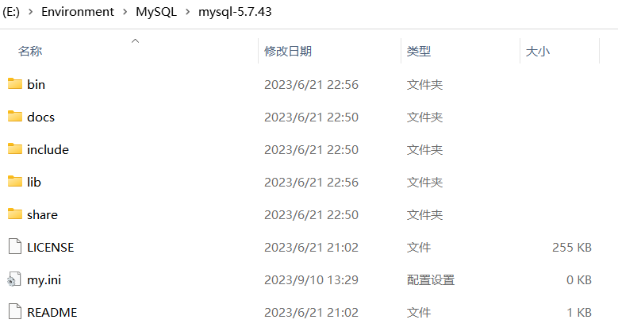
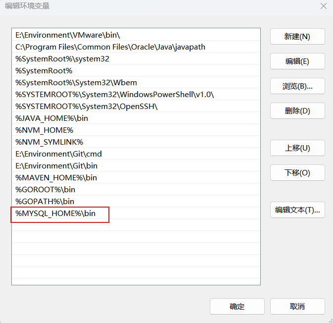
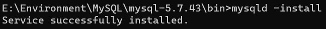
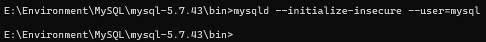
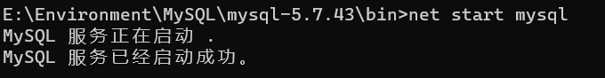
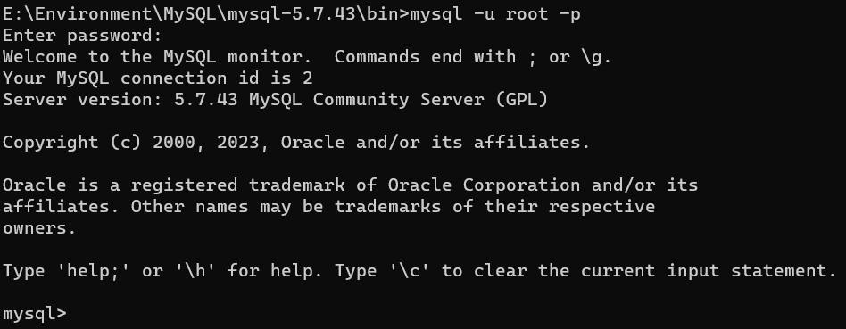
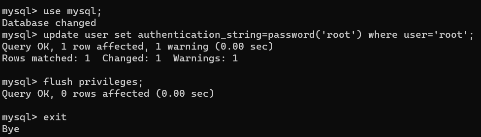

# Windows安装MySQL5.7

## 下载
- [官网](https://dev.mysql.com/downloads/mysql/)
- [阿里云](https://mirrors.aliyun.com/mysql/)
- [搜狐](http://mirrors.sohu.com/mysql/)

## 解压
- **下载版本** 
  - mysql-5.7.43-winx64.zip
- **解压缩到文件夹,路径全英文**
- **安装目录下新建my.ini文件**
  
- **my.ini文件内容**
  ```ini
  [Client]
  #设置3306端口
  port = 3306
  [mysqld]
  #设置3306端口
  port = 3306
  # 设置mysql的安装目录
  basedir=E:\\Environment\\MySQL\\mysql-5.7.43
  # 设置mysql数据库的数据的存放目录
  datadir=E:\\Environment\\MySQL\\mysql-5.7.43\\data
  # 允许最大连接数
  max_connections=200
  # 服务端使用的字符集默认为8比特编码的latin1字符集
  character-set-server=utf8
  # 创建新表时将使用的默认存储引擎
  default-storage-engine=INNODB
  sql_mode=NO_ENGINE_SUBSTITUTION,STRICT_TRANS_TABLES
  [mysql]
  # 设置mysql客户端默认字符集
  default-character-set=utf8
  ```
- **添加环境变量**
  - 新建MySQL环境变量
    
  - 添加Path系统变量
    
## 安装
- **管理员身份运行CMD**
  - 进入mysql安装bin目录,执行`mysqld -install`命令进行安装
    
  - 执行`mysqld --initialize-insecure --user=mysql`命令初始化
    
## 启动
- **管理员身份运行启动命令**
  - 输入启动命令:`net start mysql`
    
  - 输入命令进入MySQL:`mysql -u root -p`,**两次回车直接进入,无需输入密码**
    
- **设置密码**
  - 输入命令设置密码
    ```shell
    # 切换到mysql数据库
    use mysql;
    #设置密码：password:新密码；user: 用户
    update user set authentication_string=password('新密码') where user='root';
    # 刷新MySQL的系统权限相关表
    flush privileges;
    ```
    
## 引用
  - [Win10下Mysql5.7安装教程](https://www.jianshu.com/p/ea4accd7afb4)